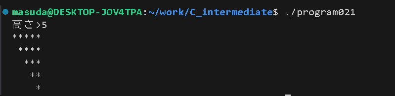

# 課題2
<div style="text-align:right;">
1X22B138 益田隆太郎

2025/10/08
</div>

### ソースコード
```c

#include <stdio.h>

void line(int c, int n);

int main(void){
	int mark = '*';
	int n;
	int i;

	printf("高さ>");
	scanf("%d", &n);
	for(i=0;i<n;i++){
		line(' ',i); line(mark,n-i); putchar('\n');
	}
	return 0;
}

void line(int c, int n){
	int i;
	for (i=0;i<n;i++){putchar(c);}
}
```
### 結果  
