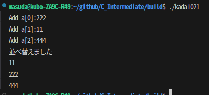

# kadai021
<div style="text-align:right;">
1X22B138 益田隆太郎

2025/10/08
</div>

3種類以上ソートできるようにバブルソートを実装しました。配列名はポインタとして振る舞うため、＆aが必要ないことを知りました。
### ソースコード
```c

# include<stdio.h>
# define NUMBER 3
// 3種類以上ソートできるように実装を変更しています。

void sort(int* data);

int main(void){
    int a[NUMBER];
    for(int i=0;i<NUMBER;i++){
        printf("Add a[%d]:",i);
        scanf("%d",&a[i]);
    }

    sort(a);//配列名はそのものがポインタとして振る舞うため、＆をつける必要がない。

    printf("並べ替えました\n");
    for(int i=0;i<NUMBER;i++){
        printf("%d\n",a[i]);
    }

    return 0;
}

void sort(int* data){
    int isEnd = 0;
    int finAdjust = 1;
    while (!isEnd){
        int loopSwap = 0;
        for(int i=0; i<NUMBER-finAdjust;i++){
            if(data[i]>data[i+1]){
                int a = data[i];
                data[i]=data[i+1];
                data[i+1]=a;
                loopSwap = 1;
            }
        }
        if(!loopSwap){
            isEnd = 1;
        }
        finAdjust++;
    }

}
```
### 結果  
