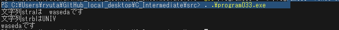

# kadai033
<div style = "text-align:right">
1X22B138 益田隆太郎

2025/10/15
</div>

### ソースコード
```c

#include <stdio.h>

int main(){
    char stra[]="waseda";
    char strb[5];

    strb[0]='U';
    strb[1]='N';
    strb[2]='I';
    strb[3]='V';
    strb[4]='\n';
    
    printf("文字列straは%8sです\n",stra);
    printf("文字列strbは%8sです\n",strb);
    return 0;
}
```

### 結果
